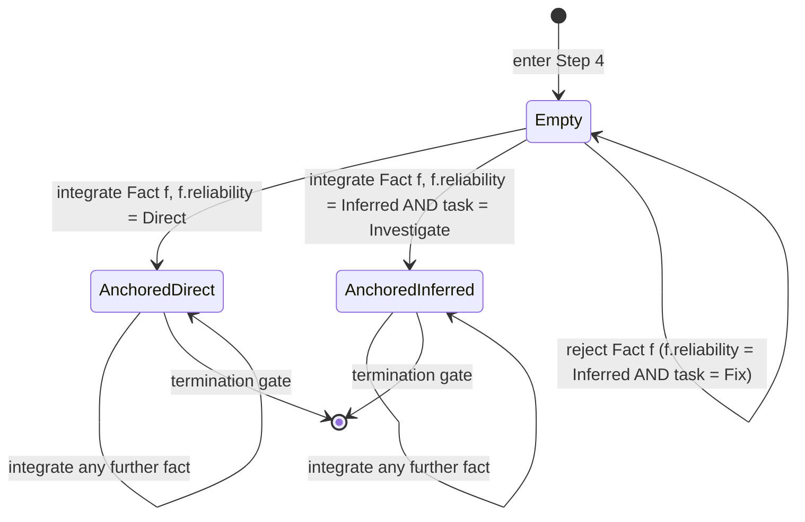

# F3 / F4 / TC19 — Fact Ordering at Step 4

The first fact integrated at Step 4 must be production-grade. This rule
gates the whole evidence log: once an `Interpreted` fact is treated as
the first fact, the investigation has been anchored on non-runtime
evidence and cannot recover without a re-baseline. Replaces
`fdp_fact_ordering.als`. Encoded as a **state machine** (#1) for the
S4 evidence-log state plus an **invariant table** (#6) for the rules.

## State machine — Step 4 evidence collection



### Transition table

| From              | Trigger                                                            | Guard                                                                   | To                | Postcondition                                          |
|-------------------|--------------------------------------------------------------------|-------------------------------------------------------------------------|-------------------|--------------------------------------------------------|
| `Empty`           | integrate `Fact f`                                                 | `f.reliability = Direct`                                                | `AnchoredDirect`  | `evidence_log.has_direct = true`, `first_fact_collected = true` |
| `Empty`           | integrate `Fact f`                                                 | `f.reliability = Inferred` AND `task = Investigate`                     | `AnchoredInferred`| `first_fact_collected = true`                          |
| `Empty`           | propose `Fact f`                                                   | `f.reliability ∈ {Interpreted, UnreliableSource}` OR (`f.reliability = Inferred` AND `task = Fix`) | `Empty` (rejected)| no state change; record the rejection in evidence-log  |
| `AnchoredDirect`  | integrate any later `Fact f` (including `Interpreted` / `Unreliable`) | none                                                                    | `AnchoredDirect`  | append `f` to evidence-log                             |
| `AnchoredInferred`| integrate any later `Fact f`                                       | none                                                                    | `AnchoredInferred`| append `f` to evidence-log                             |

### Forbidden transitions

- `Empty → AnchoredAny` via an `Interpreted` fact — central F4 / TC19 violation.
- `Empty → AnchoredAny` via an `UnreliableSource` fact — same family.
- `Empty → AnchoredInferred` for a `Fix` task — Fix tasks require `Direct` first.
- Reading repo code does NOT raise `evidence_log.has_direct` regardless of state.

## Invariants

| id      | rule                                                                                                | why                                                                                                                                  | trigger                                                                  | how to verify by hand                                                                                                                          |
|---------|-----------------------------------------------------------------------------------------------------|--------------------------------------------------------------------------------------------------------------------------------------|--------------------------------------------------------------------------|-----------------------------------------------------------------------------------------------------------------------------------------------|
| TC19-S1 | The first fact at Step 4 (any task type) must have `reliability ∈ {Direct, Inferred}`              | Anchoring on `Interpreted` evidence (e.g., reading the repo) corrupts every downstream conclusion                                    | First write to `evidence-log` per investigation                          | Read the first `E1` row; its source must classify (per F3) to `Direct` or `Inferred`                                                          |
| F4-S1   | If `task = Fix`, the first fact must have `reliability = Direct`                                   | A fix is verifying the change against production; an inferred-first anchor is too weak for a fix gate                                | Investigation `task` field is `Fix`                                      | If task is Fix, confirm E1's reliability is `Direct`, not `Inferred`                                                                          |
| F4-S2   | If `task = Investigate`, the first fact may be `Direct` or `Inferred` (but not weaker)             | Investigations may legitimately start from a recent-but-aged production observation                                                  | Investigation `task` field is `Investigate`                              | Confirm E1's reliability is in `{Direct, Inferred}`                                                                                            |
| F4-S3   | An `Interpreted` fact (repo code, spec, prior report) cannot be the first fact for any task        | Repo code is design-time, not runtime; symmetric to F3-S2                                                                            | Pre-acceptance check                                                     | If E1 is `Interpreted`, reject and ask for a production observation as E1; the `Interpreted` fact may still join the log AFTER a valid E1   |
| F4-S4   | An `UnreliableSource` fact cannot be the first fact for any task                                   | Mobile-app evidence is too divergent to anchor a baseline                                                                            | Pre-acceptance check                                                     | If E1 source is `MobileAppCode`, reject as first fact                                                                                          |
| F3-S1   | Integrating `RepoCode` does NOT raise the `evidence_log.has_direct` flag                            | Repo code never produces `Direct` (per F3); the bookkeeping flag must reflect that                                                   | Continuous (every Step-4 fact integration)                               | After integrating a `RepoCode` fact, confirm `evidence_log.has_direct` is unchanged from before                                              |
| FO-S1   | Once anchored (state `AnchoredDirect` or `AnchoredInferred`), any subsequent fact is allowed       | The first-fact rule is a baseline gate, not a permanent ban on weaker evidence                                                       | Continuous                                                               | After E1 passes, every later `E<N>` may have any reliability; F1-F11 still apply per fact                                                   |
| FO-S2   | The order in evidence-log matches integration order; no backdated insertions                        | A backdated insertion could move an `Interpreted` fact into the E1 slot                                                              | Audit run                                                                | Sort entries by `Timestamp:`; the first by timestamp must be the one classified as the anchor                                                |

## Worked example

```
Setup: Investigation task = Fix
       Proposed evidence batch:
         E1*: source=RepoCode (controller.ts inspection)        → Interpreted
         E2*: source=ProductionDB (live query)                  → Direct
         E3*: source=RecentProductionLogs (last hour)            → Direct

Walk:  State machine starts at Empty.
       F4-S3: Interpreted fact cannot be first ⇒ E1 is rejected as anchor.
       F4-S1: Fix task requires Direct as first ⇒ E1 (Interpreted) and any
              Inferred fact would also be rejected.
       Choose E2 as anchor: integrateFact(E2) ⇒ state = AnchoredDirect.
       Now E1 may be appended (FO-S1) — but it lands as E2's successor in
       the evidence-log, NOT in the anchor position.
       Then E3 appends (already AnchoredDirect, no extra constraint).

Final order: E1=ProductionDB query, E2=RecentProductionLogs, E3=RepoCode.
             (NOT the order they were proposed in.)
```
