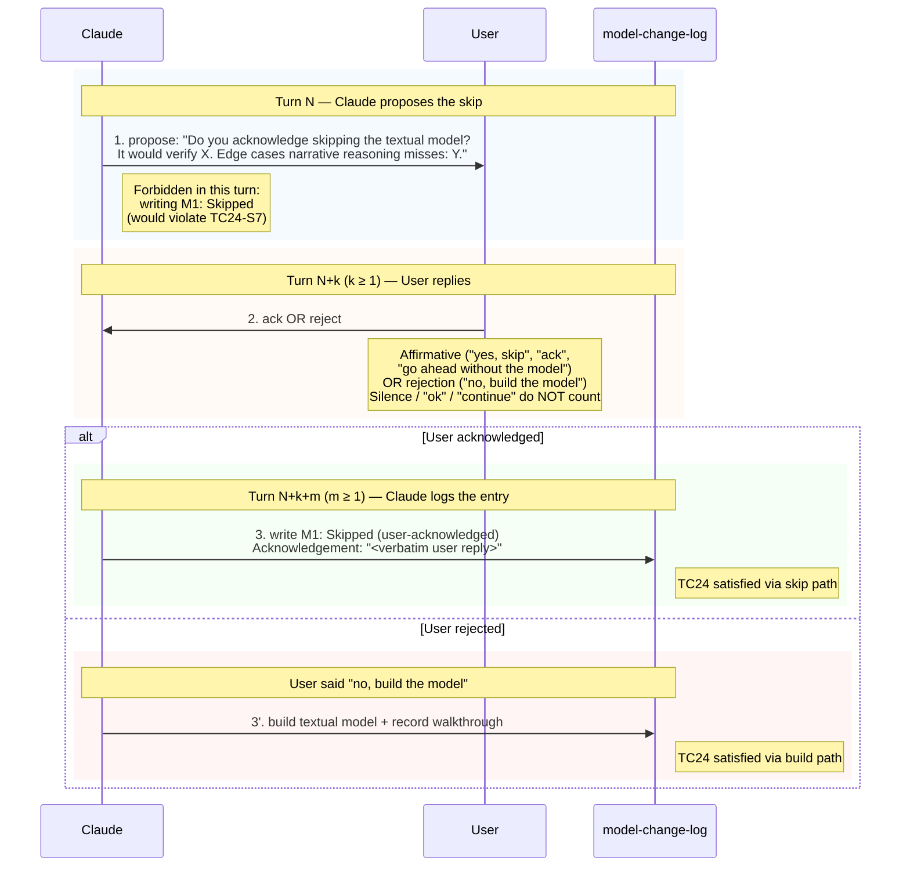

# TC24 — Model-Skip Protocol

The "skip the textual model" path is gated by an explicit user
acknowledgement that must arrive in a **different turn** from Claude's
proposal, AND must be quoted verbatim in the M1 skip entry. Replaces
`fdp_skip_protocol.als`. Encoded as a **sequence diagram** (#2) for the
turn-by-turn protocol plus an **invariant table** (#6) for the safety
properties.

> **Variant note.** This is the textual variant: "skipping the model"
> means skipping the textual model (state machine + invariant table /
> schema / etc.). Same protocol as the canonical and harness variants
> applied to a different artefact.

## Sequence diagram — turn ordering



### Disallowed interleavings

- **Silent skip** — `ack` or `entryLogged=true` without `proposed=true` first.
- **Same-turn entry** — Claude writes the M1: Skipped entry in the same turn as the proposal. The proposal turn cannot also contain the skip entry.
- **Same-turn ack-and-entry** — Claude writes the entry in the same message that acknowledges the user's reply. The entry must be its own step (the user-reply turn ends with no log entry; the next assistant turn writes the entry).
- **Inferred acknowledgement** — Claude treats silence, "ok", "continue", or prior session context as acknowledgement. Only an explicit affirmative qualifies.
- **Build after ack** — once `acknowledged=true`, building the model becomes invalid (Claude has committed to the skip path). To build, the user must explicitly reject the skip first.
- **Built and skip** — `modelBuilt=true` and `entryLogged=true` for the same M1 cannot coexist.

## Skip-entry shape

```
M1: Skipped (user-acknowledged)
Step: 1
Trigger: skip
Acknowledgement: "<verbatim user reply, character-for-character>"
Reasoning for skip:
  What the textual model would have verified: <X>
  Edge cases that narrative reasoning misses: <Y>
```

The `Acknowledgement:` field MUST quote the user's actual reply
character-for-character. The hashharness `record_model_change.py` script
takes `--acknowledgement <text>` and stores it under the ModelChange
item's `attributes.acknowledgement`; the script rejects writes where
`--menu-kinds` or `--walkthrough-summary` are also supplied.

## Invariants

| id      | rule                                                                                                | why                                                                                                                                       | trigger                                                          | how to verify by hand                                                                                                                       |
|---------|-----------------------------------------------------------------------------------------------------|-------------------------------------------------------------------------------------------------------------------------------------------|------------------------------------------------------------------|---------------------------------------------------------------------------------------------------------------------------------------------|
| TC24-S1 | A skip acknowledgement requires a prior skip proposal                                                | Catches the silent-skip antipattern: Claude writing an "acknowledged" entry when no proposal was ever surfaced                            | Audit the conversation transcript                                | Walk turns chronologically; if `acknowledged=true` is set without an earlier `proposed=true`, reject the entry                              |
| TC24-S2 | An acknowledged skip implies the model was NOT built                                                 | Build and skip are mutually exclusive for the same M1; mixing them produces an ambiguous M1 entry                                         | M1 entry write                                                   | If the M1 entry has `Acknowledgement:`, it must NOT also carry `menu_kinds` / `walkthrough_summary` and must NOT cite a `.md` model file    |
| TC24-S3 | Once past the model step, either the model was built OR the skip was acknowledged AND logged        | Step 2 (Generate hypotheses) cannot start until TC24 is satisfied via one of the two paths                                                | Pre-Step-2 gate                                                  | Confirm one of: `modelBuilt=true` OR (`proposed=true` AND `acknowledged=true` AND `entryLogged=true`)                                        |
| TC24-S4 | Building a textual model satisfies TC24 (positive form)                                              | Closes the rule positively so the build path is a valid termination of the protocol                                                       | Pre-Step-2 gate                                                  | If `modelBuilt=true`, TC24 is satisfied without any of `proposed/acknowledged/entryLogged`                                                  |
| TC24-S5 | Acknowledgement cannot fire without a prior proposal in an earlier turn                              | Stronger form of S1: enforces the temporal ordering, not just the existence                                                               | Audit transcript                                                 | The user's affirmative reply must be in a turn STRICTLY LATER than the proposal turn                                                       |
| TC24-S6 | The skip entry's `Acknowledgement:` field can only be written after the user has actually acknowledged | The verbatim-quote rule: there's nothing to quote until the user has spoken                                                               | M1 entry write                                                   | The text in `Acknowledgement:` must be a substring of an earlier user message in the transcript                                            |
| TC24-S7 | The skip entry MUST be in a different turn from the user's acknowledgement                            | Forces a beat between "user said yes" and "Claude logged it"; lets the user retract / clarify before the entry is committed               | M1 entry write                                                   | The entry's containing turn index must be > the user's acknowledgement turn index                                                          |
| TC24-S8 | The skip path satisfies TC24 only AFTER all three steps have fired                                   | TC24 cannot be claimed satisfied while any of `proposed`, `acknowledged`, `entryLogged` is still false                                    | Pre-Step-2 gate                                                  | If TC24 is claimed via skip path, all three flags must be true                                                                              |
| TC24-S9 | Building the model after the user acknowledged the skip is forbidden                                 | The user committed to the skip path; switching to build without re-asking would silently overrule the user                                | Anytime an attempt is made to build after ack                    | If `acknowledged=true`, the only valid path forward is to write the entry; to switch to build, ask for and receive an explicit reject       |

## Worked example — happy path (skip)

```
Turn N (Claude):
  "I'd like to propose to skip the textual model here. The model would
   verify: that the request body has every required field on every
   handler. Edge cases I'd miss without it: contract drift between
   frontend and backend, other recently-renamed fields, other handlers
   that read this payload shape. Do you acknowledge skipping?"

  Internal state: proposed=true, acknowledged=false, entryLogged=false

Turn N+1 (User):
  "yes go ahead without the model"

  Internal state: acknowledged=true (kept after applying TC24-S5/S6:
                  affirmative reply in a strictly-later turn)
                  entryLogged still false

Turn N+2 (Claude — separate turn from N+1, satisfies TC24-S7):
  Writes ModelChange item with attributes:
    model_id: "M1"
    step: 1
    trigger: "skip"
    acknowledgement: "yes go ahead without the model"
  No menu_kinds or walkthrough_summary (TC24-S2 / S8).

  Internal state: entryLogged=true; TC24 satisfied via skip path.
```

## Worked example — anti-pattern (silent skip)

```
Turn N (Claude):
  Writes M1: Skipped (user-acknowledged) directly without ever asking.

  Audit walks transcript, finds no earlier `proposed=true`.
  TC24-S1 ⇒ FAIL
  Reject the entry.
```

## Worked example — anti-pattern (same-turn entry)

```
Turn N (Claude):
  "I'll skip the formal model. M1: Skipped (user-acknowledged).
   Acknowledgement: <none yet>"

  Audit: proposed and entryLogged set in the same turn; acknowledged false.
  TC24-S1 ⇒ FAIL (no acknowledgement)
  TC24-S6 ⇒ FAIL (Acknowledgement field empty / fabricated)
  TC24-S7 ⇒ FAIL (entry in same turn as proposal — and there's no
                  user-reply turn between them)
  Reject the entry.
```
