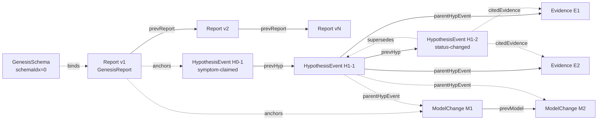

# TC29 / TC30 / TC36 — HashHarness Storage Chain Integrity

How investigation items hang together in hashharness storage. Replaces
`system-models/harness/fdp_storage_chain.als`. Encoded as a **DAG** (#3)
for the chain topology, a **schema** (#4) for each item type, and an
**invariant table** (#6) for the integrity rules.

This sits one layer above the hashharness server's own correctness
properties (`UniqueText`, `RecordHashUnique`, `NoBackdate`, `NoFork`,
`SchemaBinding`). The rules below assume those primitives hold and
verify that **our protocol uses them correctly** — initialisation order,
link target_types, citedEvidenceHash one-to-one over Evidence sets,
single-write discipline.

## Chain topology



Edge legend:

| Edge style | Link kind                              | Cardinality |
|------------|----------------------------------------|-------------|
| `-->`      | `prev*` chain (predecessor in same type) | single      |
| `-.->`     | cross-type link (`parentHypEvent`, `citedEvidence`, `supersedes`) | single or many depending on field |

## Item schemas

```yaml
# Common to every item
Item:
  record_sha256:    server-computed identity hash; unique
  created_at:       server-stamped wall-clock time (callers cannot supply)
  created_idx:      logical creation order (≥1 for items; 0 reserved for GenesisSchema)
  schema_sha256:    record_sha256 of the schema head AT WRITE TIME

Report:
  attributes:
    version_num:    int ≥ 1
  links:
    prevReport:     # absent on Report v1 (GenesisReport)
      kind:         single
      target_types: [Report]
      chain_predecessor: true   # CAS-protected by the server

HypothesisEvent:
  attributes:
    event:          enum (created | mechanism-stated | counterfactual-stated |
                          observability-assessed | alternative-considered |
                          equivalence-checked | status-changed | accepted)
    hypothesis_id:  string
    event_seq:      int
    # plus event-specific fields (e.g., new_status, reason, priority, rationale)
  links:
    prevHyp:        # required
      kind:         single
      target_types: [HypothesisEvent, Report]    # Report only for the chain anchor (H0-1)
    citedEvidence:  # required on status-changed/accepted; possibly empty on others
      kind:         many
      target_types: [Evidence]
    supersedes:     # optional
      kind:         single
      target_types: [HypothesisEvent]

Evidence:
  attributes:
    evidence_id:    string
    source:         enum (per F3 source classification)
    reliability:    enum (Direct | Inferred | Interpreted | UnreliableSource)
    # plus F6-F11 audit fields when applicable
  links:
    parentHypEvent: # required
      kind:         single
      target_types: [HypothesisEvent]

ModelChange:
  attributes:
    model_id:       string (M1, M2, …)
    step:           int
    trigger:        enum (initial | fact-integration | deepening |
                          fix-verification | skip)
    menu_kinds:     list of enums (state-machine | sequence-diagram | dag |
                                    schema | decision-table | invariant-table |
                                    type-taxonomy | worked-example)
    walkthrough_summary: string ("pass=N, fail=N, pending=N, n/a=N")
    # for trigger=skip, menu_kinds and walkthrough_summary are absent and
    # `acknowledgement` is required instead
  links:
    prevModel:      # required (Report v1 for the first M)
      kind:         single
      target_types: [ModelChange, Report]
    parentHypEvent: # required
      kind:         single
      target_types: [HypothesisEvent]
```

## Server-derived fields (do not write)

- **`record_sha256`** — server-computed from `text + meta + links + schema`
- **`created_at`** — server-stamped (no caller-supplied timestamps; eliminates backdating)
- **`citedEvidenceHash`** (on HypothesisEvent) — server-derived from the sorted set of cited Evidence record_sha256 values; same set ⇒ same hash, distinct sets ⇒ distinct hashes

## Invariants

| id      | rule                                                                                                                                                              | why                                                                                                                                  | trigger                                                                       | how to verify by hand                                                                                                                                                  |
|---------|-------------------------------------------------------------------------------------------------------------------------------------------------------------------|--------------------------------------------------------------------------------------------------------------------------------------|-------------------------------------------------------------------------------|------------------------------------------------------------------------------------------------------------------------------------------------------------------------|
| TC29-S1 | Genesis schema (`schemaIdx=0`) is created before Report v1; Report v1 is created before any other item                                                            | Without an initialised schema and an anchor Report, no item type can be validated; PW0-init is a write-time gate                     | Investigation start                                                           | `mcp__hashharness__get_schema` returns the four type definitions; `get_work_package` returns Report v1; no items of other types exist yet                              |
| TC30-S1 | A `prevHyp` link must target a `HypothesisEvent` or `Report` (never `Evidence`, never `ModelChange`)                                                              | Wrong-type predecessor breaks the chain semantics; the agent could otherwise hide a hypothesis event by pointing at evidence         | Hypothesis-event write                                                        | Inspect the linked item's type; reject any HypothesisEvent whose `prevHyp` target is `Evidence` or `ModelChange`                                                       |
| TC30-S2 | A `prevModel` link must target a `ModelChange` or `Report`                                                                                                        | Same as above for the model chain                                                                                                    | Model-change write                                                            | Inspect target type                                                                                                                                                    |
| TC30-S3 | `citedEvidenceHash` is consistent with the cited evidence set: same Evidence record_sha256 multiset ⇒ same `citedEvidenceHash`; distinct multisets ⇒ distinct hashes | Server-derived; the agent must not invent or override it. Manual override would let an acceptance event claim it cited evidence it did not | Pre-acceptance audit                                                          | `mcp__hashharness__verify_chain` checks this. Manually: sort the cited Evidence record_sha256 values, take their concatenated sha256, compare to `citedEvidenceHash` |
| TC30-S4 | Every `HypothesisEvent` and `ModelChange` chain anchors on the GenesisReport (Report v1) via its respective `prev*` link                                          | All items in a work package must derive from the v1 anchor; orphan chains are not part of the audit                                  | Pre-acceptance audit                                                          | Walk `prevHyp` from any tip; the chain must reach GenesisReport. Same for `prevModel`                                                                                  |
| TC30-S5 | A `supersedes` link must point at an item with strictly smaller `created_idx` (no forward supersession)                                                            | Server-enforced (cannot link to an item that doesn't yet exist); included as an invariant for clarity                                | Hypothesis-event write with `supersedes`                                       | Compare `created_idx` of the superseder vs the superseded                                                                                                              |
| TC30-S6 | Two non-genesis Reports never share the same `prevReport` (Report chain is fork-free; CAS-protected)                                                              | Report v1 → v2 → v3 is a single line, not a tree. Forks would let a "report v2" race past a competing one and hide one of them      | Report write                                                                  | If two Reports `r1, r2` (neither v1) name the same predecessor, the chain is forked — re-run the audit; the server should have rejected one                            |
| TC30-S7 | Every item's `schema_sha256` references a schema version that pre-existed at the item's write time                                                                | Cannot bind to a phantom schema; binding must be reproducible after the fact                                                         | Item write                                                                    | The schema version's `schemaIdx` must be < the item's `created_idx` ; verify via `get_schema_version`                                                                  |
| TC30-S8 | The schema chain itself is append-only and CAS-protected (GenesisSchema, then v2 → v3 → …)                                                                        | If the schema chain forks, item bindings become ambiguous                                                                            | `set_schema` write                                                            | `get_schema_history` returns a single linear chain; each version's `schemaPrev` is unique                                                                              |
| TC36-S1 | Each item is created by exactly one `create_item` call; no two items share a `created_idx`                                                                       | The "no batch helper" rule: every record corresponds to one structured-prose Write turn                                              | Continuous                                                                    | Confirm `created_idx` values are unique across the work package                                                                                                        |
| TC36-S2 | A batch script that creates many items in one invocation is forbidden                                                                                            | Same goal as TC36-S1; expressed as a process rule. The harness wrappers each create exactly ONE item per invocation                  | Investigation in progress                                                     | Audit the agent's transcript for any tool call that creates more than one item; reject the investigation                                                              |
| TC30-S9 | `verify_chain` returns `ok: true` on the work package's tip                                                                                                       | The single mechanical gate that summarises the above; if it returns `ok: false`, the protocol has been violated                      | Pre-acceptance check                                                          | Run `mcp__hashharness__verify_chain` on the latest item; require `ok: true`                                                                                            |

## Worked example — what `verify_chain` validates

```
Setup: A complete investigation: Reports v1 + v2, hypotheses H0-1, H1-1, H1-2,
       Evidence E1, E2, ModelChange M1.

Walk:  TC30-S1: H1-1.prevHyp = H0-1 (HypothesisEvent ✓), H1-2.prevHyp = H1-1 (✓)
       TC30-S2: M1.prevModel = R1 (Report v1 ✓)
       TC30-S3: H1-2 cites {E1, E2}.
                Compute sha256(sort(E1.record_sha256, E2.record_sha256)).
                Compare to H1-2.citedEvidenceHash → match ✓
       TC30-S4: ^prevHyp from H1-2 reaches R1 ✓; ^prevModel from M1 reaches R1 ✓
       TC30-S5: no supersedes used ✓
       TC30-S6: R2.prevReport = R1; only one R has predecessor R1 → fork-free ✓
       TC30-S7: every item's schema_sha256 = GenesisSchema (schemaIdx=0); all items
                have created_idx ≥ 1 ⇒ schemaIdx < created_idx ✓
       TC36-S1: created_idx values: GenesisSchema=0, R1=1, H0-1=2, E1=3, H1-1=4,
                M1=5, E2=6, H1-2=7, R2=8 — all distinct ✓

Outcome: verify_chain returns ok:true. Pre-acceptance audit passes.
```
