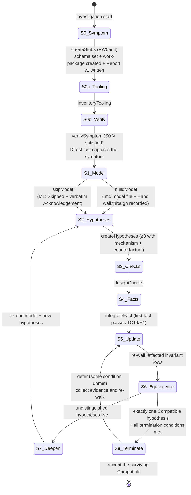
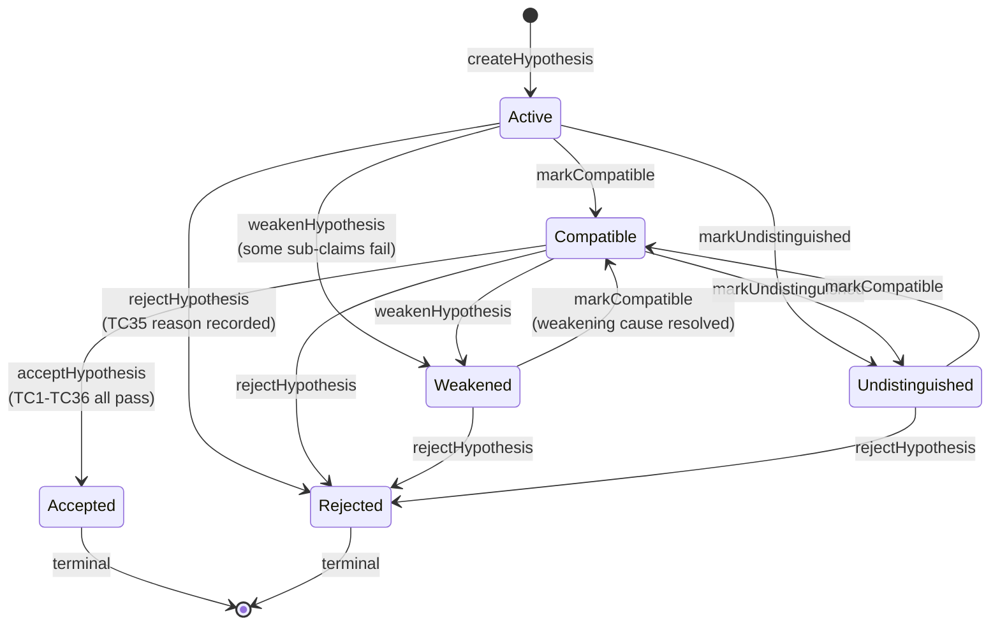

# Investigation Lifecycle (Temporal Core)

The state machine over investigation steps and hypothesis statuses.
Replaces `fdp_temporal_core.als`. Encoded as a **state machine** (#1) for
the per-step lifecycle plus an **invariant table** (#6) for the gates.

> **Variant note (alter group).** This is the textual variant. Two
> semantics shift relative to the canonical / harness `fdp_temporal_core`:
>
> - **`buildModel` postcondition** — the model is now a `.md` file with menu-derived diagrams / tables (per `representation-menu.md`), and the gate is **a recorded hand walkthrough**, not a solver result.
> - **TC28** — "Textual model exists with `Hand walkthrough:` field, OR `M1: Skipped (user-acknowledged)` with verbatim `Acknowledgement:`". The wording shifts from "solver results" to "hand walkthrough"; the structural shape (M1 entry with one of two fields) is preserved.
>
> All other transitions match the canonical lifecycle.

## State machine — investigation step lifecycle



## State machine — hypothesis status



### Hypothesis transition table

| From              | Allowed transitions                                       | Forbidden transitions                       |
|-------------------|-----------------------------------------------------------|---------------------------------------------|
| `Active`          | `Compatible`, `Weakened`, `Rejected`, `Undistinguished`   | `Accepted` (must pass through `Compatible`) |
| `Compatible`      | `Accepted`, `Weakened`, `Rejected`, `Undistinguished`     | `Active` (no regression)                    |
| `Weakened`        | `Rejected`, `Compatible`                                  | `Active`, `Accepted` (direct)               |
| `Undistinguished` | `Compatible`, `Rejected`                                  | `Active`, `Accepted` (direct)               |
| `Rejected`        | (terminal)                                                | any other                                   |
| `Accepted`        | (terminal)                                                | any other                                   |

## Invariants — per-step gates

| id          | rule                                                                                                                                                                                              | why                                                                                                                              | trigger                                                              | how to verify by hand                                                                                                                                |
|-------------|---------------------------------------------------------------------------------------------------------------------------------------------------------------------------------------------------|----------------------------------------------------------------------------------------------------------------------------------|----------------------------------------------------------------------|------------------------------------------------------------------------------------------------------------------------------------------------------|
| PW0-init    | Stubs (work-package, schema, Report v1) exist BEFORE any tooling inventory, symptom verification, hypothesis, evidence, or model-change is recorded                                               | Without an anchor, no item type can be linked correctly; the chain has no genesis                                                | Investigation start (S0)                                             | Confirm `get_schema` returns the four type definitions; `get_work_package` returns Report v1; no items of other types yet                            |
| S0V-S1      | Symptom is verified against production (a `Direct` fact captures the symptom) before leaving `S0b_Verify`                                                                                         | Otherwise the investigation is anchored on user-paraphrased description, not on the failing system                               | Transition out of `S0b_Verify`                                       | E1 (or earlier) must have `reliability=Direct` and cite the symptom by reproducing it from production                                                |
| S0aT-S1     | Tooling inventory is filled before leaving `S0a_Tooling`                                                                                                                                          | Skipping the inventory leaves the agent re-discovering tools mid-investigation                                                   | Transition out of `S0a_Tooling`                                      | `investigations/<slug>/tooling-inventory.md` exists and is non-empty                                                                                  |
| FM1         | ≥1 `Direct` fact is in evidence-log BEFORE `buildModel` fires; sequence: verify → tools → hypothesise → model → walk → verify-fix                                                                 | Modeling without grounding wastes effort; a model written before `Direct` evidence is shaped by speculation                      | Transition out of `S1_Model` via `buildModel`                        | Confirm `evidence_log.has_direct=true` before the M1 entry                                                                                            |
| PV1         | Acceptance requires `≥1 Direct` fact supporting the accepted hypothesis                                                                                                                           | Repo-only / interpretation-only acceptances are TC1 failures                                                                     | `acceptHypothesis`                                                   | Walk the cited evidence; require at least one `Direct` row                                                                                            |
| PV2         | The skip path requires the three-step protocol (`fdp_skip_protocol.md`) — propose, acknowledge in a later turn, log entry in yet another turn                                                     | Inferred / silent skips mask the choice; the verbatim ack provides accountability                                                | `skipModel` transition                                               | See `fdp_skip_protocol.md` invariants TC24-S1…TC24-S9                                                                                                |
| **TC28**    | `S8_Terminate` requires: `M1` exists with **`Hand walkthrough:` field** (every invariant row marked `pass` / `fail` / `pending` / `n/a`), OR `M1: Skipped (user-acknowledged)` with verbatim `Acknowledgement:` | Variant rule: walkthroughs replace solver results as the proof-of-effort that the model was actually consulted                  | Pre-`acceptHypothesis` gate                                          | Read M1's `attributes`: must include `walkthrough_summary` (and the text body row-by-row) OR `acknowledgement` (verbatim). Never both, never neither |
| H1          | Every hypothesis has the four-part shape `[condition] → [mechanism] → [state change] → [symptom]`                                                                                                 | Without all four, the hypothesis is too vague to design distinguishing checks                                                    | Hypothesis creation / mechanism-stated event                         | Read each H record; confirm all four parts are present                                                                                                |
| H2 / FZ1    | Every hypothesis has a stated counterfactual: what observation would make it false?                                                                                                                | Unfalsifiable hypotheses cannot be rejected by evidence; they can only be ignored                                                | Hypothesis creation / counterfactual-stated event                    | Read each H record; confirm `counterfactual:` field exists and names a concrete observation                                                          |
| FZ2         | The counterfactual must be observable with current telemetry; if not, observability must be deepened FIRST                                                                                        | An unobservable counterfactual is unfalsifiable in practice                                                                      | observability-assessed event                                         | Confirm `observable:` field is `yes` (or that an observability-deepening step has been taken)                                                        |
| T1          | Every check distinguishes ≥2 hypotheses; checks compatible with all live hypotheses are zero-information                                                                                          | Checks that don't narrow the space waste the experiment budget                                                                   | Step 3                                                               | For each check, list which hypotheses it distinguishes; reject `Irrelevant`-strength checks                                                          |
| U1          | Acceptance requires exactly one `Compatible` hypothesis; if multiple are `Compatible` and undistinguished, deepen instead of pick                                                                 | Picking by likelihood gives false confidence; only U1 closes the case                                                            | `acceptHypothesis`                                                   | Count `Compatible` records at termination; must be exactly one                                                                                        |
| U2-doc / TC35 | Every `Rejected` hypothesis carries a structured rejection reason (evidence-cite OR allowed-priority-with-rationale)                                                                            | See `fdp_rejection_reasons.md`                                                                                                   | Rejection write                                                      | See `fdp_rejection_reasons.md` invariants TC35-S1…TC35-S7                                                                                            |
| M1-cover    | All 14 cause classes from `fdp_core.md` reviewed before acceptance                                                                                                                                | Catches systematic blind spots (concurrency, caching, …)                                                                         | Pre-`acceptHypothesis` gate                                          | Confirm Model Coverage row exists for each of the 14 `CauseClass` atoms; each marked considered or n/a                                              |
| M2          | Alternative mechanism considered before acceptance                                                                                                                                                | Catches "first plausible explanation wins" failure mode                                                                          | `alternative-considered` event                                       | Confirm `alternative-considered` event exists for the leading hypothesis                                                                              |
| F5          | `Direct` evidence is re-verified after deploy / migration before being treated as still-true                                                                                                      | Direct evidence decays; an investigation that paused for a deploy may have stale anchors                                         | Acceptance after a deploy / migration occurred mid-investigation     | For each `Direct` evidence record cited at acceptance, confirm `Re-verified-at: <timestamp>` covers the post-deploy state                            |
| PW0-live    | Hashharness chain integrity holds at acceptance time (`verify_chain` returns `ok: true`)                                                                                                          | See `fdp_storage_chain.md`                                                                                                       | Pre-acceptance audit                                                 | See `fdp_storage_chain.md` invariants TC30-S1…TC30-S9                                                                                                |
| PW0-strict  | Each item is created via exactly one `create_item` invocation; no batch helpers                                                                                                                   | One Write turn per record keeps the audit trail interpretable                                                                    | Continuous                                                           | See `fdp_storage_chain.md` TC36-S1 / TC36-S2                                                                                                          |

## Step-specific gates (by entry / exit conditions)

```
S0_Symptom    → S0a_Tooling :  PW0-init firing condition (stubs created)
S0a_Tooling   → S0b_Verify  :  tooling-inventory.md non-empty (S0aT)
S0b_Verify    → S1_Model    :  symptomVerified=true, evidence_log.has_direct=true (S0V)
S1_Model      → S2          :  modelOrSkipReady=true; via build OR ack-skip (TC24/TC28/PV2)
S2_Hypotheses → S3_Checks   :  ≥1 hypothesis with mechanism + counterfactual (H1/H2)
S3_Checks     → S4_Facts    :  ≥1 check designed with non-Irrelevant strength (T1)
S4_Facts      → S5_Update   :  first integrated fact has reliability ∈ {Direct, Inferred}
                              ;  AND if task=Fix, reliability=Direct (TC19/F4)
S5_Update     → S6_Equiv    :  modelRerunAfterFacts=true (PW2 — re-walk after evidence)
S6_Equiv      → S7_Deepen   :  ≥1 hypothesis Undistinguished (continue exploring)
S6_Equiv      → S8_Terminate:  no hypothesis Undistinguished (ready to terminate)
S8_Terminate  → accept     :  TC1…TC36 all pass (the big termination gate)
S8_Terminate  → S5_Update  :  some condition unmet → return to fact integration
S7_Deepen     → S2          :  model extended with new layer; new hypotheses generated
```

## Worked example — happy-path lifecycle

```
Setup:  Webhook delivery drops 2%. Task = Investigate.

Trace:  S0_Symptom    : symptom-claimed event H0-1 written.
        S0a_Tooling   : tooling-inventory.md filled.
        S0b_Verify    : E1 = production query reproducing the 2% drop (Direct).
        S1_Model      : M1 written, .md file with state-machine + invariant table
                        for the webhook delivery / retry path. Hand walkthrough:
                        retry-row=pending, queue-saturation-row=pending, …
                        → modelOrSkipReady=true via build path (TC28 satisfied).
        S2_Hypotheses : H1 (queue saturation), H2 (retry false-200), H3 (TCP loss).
        S3_Checks     : check_a (Datadog CPU saturation correlation, Strong vs H1),
                        check_b (receiver access logs, Strong vs H3), …
        S4_Facts      : E2 = Datadog dashboard hit-rate (Direct, supports H1).
                        E3 = receiver logs zero-match (Direct, supports H3).
        S5_Update     : re-walk M1's invariant rows; queue-saturation row = pass,
                        TCP-loss row = fail (E3 contradicts H3 — receiver never
                        saw the connection). H3 → Rejected (evidence-based).
        S6_Equiv      : H1 and H2 still Compatible. Are they distinguished?
                        E2's hit-rate at saturation moments distinguishes them
                        (H2 would not predict the correlation). H2 → Rejected.
        S6_Equiv      : H1 sole Compatible.
        S8_Terminate  : TC1-TC36 walked; all pass. acceptHypothesis(H1).

Outcome: investigation accepted on H1 — webhook-delivery pool saturates,
         retry wrapper logs HTTP 200 on first-attempt response even when
         socket reset before body fully read.
```
